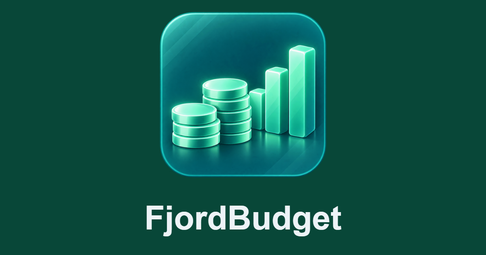

# FjordBudget



## Installer gennem FjordHub

Find **FjordBudget** i appkataloget, vælg port (standard 8060) og datamappe, og installér.
Åbn appen fra FjordHub for automatisk login, eller brug samme brugernavn og adgangskode
på login-siden. Første administrator, der logger ind, bliver ejer af installationens budget.
Andre brugere får ikke adgang til ejerens data, heller ikke hvis de får en app-rolle.
Til flere uafhængige budgetejere bruges separate installationer.

Domænet vælges **efter installationen** i FjordHubs app-indstillinger. Brug et dedikeret
HTTPS-domæne med proxy til appens port. FjordBudget henter adressen fra FjordHub
(cache højst 30 sekunder), og bankens returadresse vises under **Forbind bank**.
Undermappemontering understøttes ikke; brug et subdomæne. Ingen forwarded host/proto
headers bruges som tillidsgrundlag. Private LAN-adresser understøttes også.

Installationsmanifest: [fjordhub.json](fjordhub.json). Serveropsætning:
`docker-compose.fjordhub.yml`. Denne opsætning kræver FjordHub-nøgle og lukker ved
manglende konfiguration. Login og aktuelle rettigheder valideres hos FjordHub.
Hvis FjordHub ikke kan kontaktes, gives ingen adgang til budgetdata.
Første login kræver admin-rolle; ejerskabet gemmes i databasen og overlever opdateringer.

Offentlige informationssider: [privatlivspolitik](https://qlerup.github.io/fjordbudget/privacy.html)
og [brugsvilkår](https://qlerup.github.io/fjordbudget/terms.html). Appen serverer også
`/privacy` og `/terms` på sit eget domæne uden login. Oplysningerne til bankens API
gemmes efter installationen via formularen; del dem ikke i Git eller manifestet.


Lokal budgetapp med danske tekster, kontooversigt, saldi, bogførte posteringer,
kategorier og månedsbudget. Startversion til én person på egen computer.

## Start i Docker Desktop

```powershell
docker compose up -d --build
```

Åbn **http://localhost:8060**. Demovisningen indeholder fiktive konti og fire
måneders eksempelposteringer. Knappen **Mine bankdata** skifter til det separate
område for egne konti. Demodata blandes aldrig med bankdata.

```powershell
docker compose logs --tail 100 app
docker compose stop
docker compose start
```

Desktop-opsætningen `compose.yaml` er fortsat kun eksponeret på `127.0.0.1:8060`
og har ikke login. Brug altid FjordHub-opsætningen til LAN eller internet.
Skift aldrig serverinstallationen til `AUTH_MODE=local`.

## Bankforbindelse: kun læseadgang

Integrationen bruger Enable Banking **Account Information Services (AIS)** til
konti, saldi og bogførte posteringer. Der er ingen betalingsfunktioner. API-klienten
afviser betalingsendpoints, også hvis en API-applikation ellers har PIS-rettigheder.
POST bruges alene til at starte bankens godkendelse og udveksle godkendelseskoden;
DELETE bruges kun til at afbryde et læsesamtykke.

1. Opret en applikation på <https://enablebanking.com/cp/applications>.
2. Brug **Sandbox** til test. Brug **Production** og tilknyt egne konti hos udbyderen
   for begrænset adgang til egne rigtige konti. Bankdækning, vilkår og eventuelle
   omkostninger skal kontrolleres hos udbyderen. Appen lover ikke adgang til alle
   danske banker eller alle kontotyper.
3. Registrer returadressen `http://localhost:8060/bank/callback` præcis som skrevet.
   Den skal accepteres og registreres af udbyderen; brug ikke en offentlig tunnel
   som genvej uden først at tilføje login og HTTPS til appen.
4. Åbn **Forbind bank**, og indsæt app-id og hele den private RSA-nøgle (PEM)
   i formularen. Tryk **Gem og fortsæt**. Ingen ændring af `.env` eller genstart
   er nødvendig. **Skift API-oplysninger** kan bruges til at erstatte dem senere.
5. Oplysningerne gemmes krypteret som `/data/bank-credentials.enc` i det persistente
   Docker-volumen med begrænsede filrettigheder. Nøglen sendes aldrig tilbage til
   browseren. Gemte oplysninger har prioritet over den valgfrie `.env`-opsætning
   med `ENABLE_BANKING_APP_ID` og `secrets/enablebanking.pem`.
6. Brug appen via **localhost**, ikke `127.0.0.1`, så browserens cookie følger med
   gennem bankens returadresse.
7. Tryk **Forbind bank**, vælg din danske bank, og godkend læseadgangen hos banken.
   MitID og banklogin foregår uden for FjordBudget; appen indsamler ikke disse oplysninger.
8. Vælg **Mine bankdata → Opdater saldi** for den første hentning. Der hentes op til
   de seneste 90 dages bogførte posteringer, afhængigt af bankens adgang og historik.
   Tidligere hentede posteringer bevares lokalt. Derefter synkroniserer FjordBudget
   automatisk aktive bankkonti, når deres seneste hentning er mindst 30 minutter gammel.
   Knappen kan stadig bruges til en manuel opdatering når som helst.

Når samtykket udløber, forbindes banken igen. Stabil kontohash genbruger kontoen
og bevarer historik og manuelle kategorier. **Mine banker → Afbryd bankadgang**
tilbagekalder sessionen hos udbyderen og standser ny hentning; de allerede hentede
data bevares lokalt.

Udbyderens API er implementeret og testet med kontrollerede API-svar. En rigtig
bankgodkendelse og import er **ikke verificeret**, før app-id, nøgle og samtykke
er sat op. Demovisningen kræver ingen API-adgang.

Officielle kilder:
- <https://enablebanking.com/docs/api/reference/>
- <https://enablebanking.com/docs/faq/>
- <https://enablebanking.com/docs/api/quick-start/alt>

## Beløb og budget

- Beløb gemmes som heltal i valutaens hundrededele. Flydende decimaltal bruges
  ikke til lagring eller summering.
- DKK, EUR, SEK, NOK, GBP, USD, CHF og PLN understøttes. Valutaer summeres separat;
  der foretages ikke automatisk valutakonvertering.
- Saldo er den senest hentede bankbalance; det er ikke en beregnet saldo ved
  slutningen af den valgte måned. Bogført saldo foretrækkes frem for disponibel.
- Månedsbudget er udgiftslofter pr. kategori, ikke en prognose for kontosaldo.
- Kategorien **Overførsler** udelades fra indtægter/udgifter. Genkendelsen er enkel:
  kontrollér kategorierne, især overførsler mellem egne konti.
- Gentagen import bruger bankens `entry_reference` pr. konto. Hvor banken ikke
  leverer en stabil reference, bruges dato, beløb, valuta, tekst og forekomstnummer.
  Det bevarer identiske køb, men hvis banken senere ændrer tekst/dato på en postering
  uden stabil reference, kan manuel afstemning være nødvendig.
- Reserverede/afventende beløb vises ikke i første version. Bankens balance kan
  derfor afvige fra summen af de viste bogførte posteringer.
- Alle sider fra banken hentes før kontoens import gemmes. Fejl på én konto
  sletter ikke historik og forhindrer ikke de øvrige konti i at blive opdateret.

## Forbrugsanalyse og opsparingsmål

FjordBudget analyserer de seneste måneders bogførte indtægter og udgifter for at vise,
hvor pengene går hen, og hvor stort et historisk råderum der har været. Overførsler
mellem egne konti holdes ude af beregningen.

På en postering kan du manuelt angive den rigtige forhandler og vælge **Husk fremover**.
Reglen knyttes til den normaliserede, fulde banktekst. FjordBudget gætter ikke en
forhandler ud fra enkelte forkortelser som korttype eller terminaltekst. Bankens
originale posteringstekst bevares altid.

Opsparingsmål kan indeholde målbeløb, allerede opsparet beløb og deadline. Et mål
kan valgfrit kobles til en konto; i så fald bruges kontoens senest synkroniserede saldo
automatisk som målets opsparede beløb. Det manuelle beløb bevares og bruges igen, hvis
konto-linket fjernes. Ét mål markeres som aktivt og vises på overblikket. Appen beregner, hvor meget der kræves
pr. måned, sammenholder det med historisk råderum og markerer målet som realistisk,
stramt, muligt med ændringer eller ikke realistisk med den nuværende økonomi.

Besparelsesforslag tager udgangspunkt i faktisk forbrug hos lærte forhandlere.
Kategorier bruges ikke til opsparingsmålenes besparelsesforslag; de hører primært
til budgetdelen. En forhandler kan markeres som fast udgift og bliver så helt udeladt
fra forslagene. For justerbare forhandlere bruger analysen et konservativt potentiale
på 10 % af det månedlige gennemsnit. Forslagene ændrer aldrig budget eller posteringer
automatisk.

## Data og backup

Docker-volumen `fjordbudget_budget_data` indeholder SQLite-database samt
krypterings- og sessionsnøgler. Bankens sessions-id'er og fjernkonto-id'er er
krypteret med Fernet. Posteringer og budgettal er almindelige lokale databaseposter;
hele databasen er ikke krypteret. Brug diskbeskyttelse på computeren.

Backup skal omfatte hele datavolumen, inklusive krypteringsnøglen og
`bank-credentials.enc`. Bruger du den valgfrie filopsætning, medtag også den
private API-nøgle i `secrets/`. Krypteringen beskytter ikke mod adgang til hele
datavolumen, da krypteringsnøglen også ligger der.
Bevar filerne sammen og privat. Stop appen før en filbaseret kopi af datavolumen,
så SQLite-filerne er konsistente. `docker compose stop` og almindelig genopbygning
bevarer data. `docker compose down -v` sletter datavolumen og skal ikke bruges til
rutinemæssig opdatering.

Login-siden begrænser adgangskodeforsøg til fem pr. fem minutter pr. direkte klient-IP
(pr. proxy ved reverse proxy). Sessionscookies er HttpOnly/SameSite og Secure på det
HTTPS-domæne, der er valgt i FjordHub.

CSRF-tokens beskytter skrivninger, godkendelsens state er engangsbrug med 15
minutters levetid og bundet til browseren, og Host-headeren valideres mod lokal drift eller domænet valgt i FjordHub.
Der er ingen eksterne fonte, CDN-scripts, analyseværktøjer eller betalings-API'er.

## Udvikling og test

Python 3.13, Flask, SQLite og almindelig HTML/CSS/JavaScript. Én Gunicorn-worker
med tråde, fordi den lokale synkroniseringslås er proceslokal.

```powershell
python -m pip install -r requirements.txt playwright
python -m playwright install chromium
python -m unittest discover -s tests -v
```

Testene bruger midlertidige databaser. Browserregressioner dækker mobilvisning,
konto-navigation, søgning, kategorisering, budgetlagring, fejlsvar og bankopsætning.
Backendtestene dækker dubletter, flere identiske køb, pengebeløb, valutaadskillelse,
CSRF/Host, engangsgodkendelse, krypterede tokens og sideinddelt import.

## Privatlivspolitik og brugsvilkår

Appen har selvstændige informationssider på `http://localhost:8060/privacy` og
`http://localhost:8060/terms`, med links fra bankopsætningen. Teksterne beskriver
én persons lokale installation og skal tilpasses, hvis driften eller målgruppen ændres.
Kontaktmailen angives af ejeren i Enable Bankings registreringsformular.

Disse lokale adresser er kun tilgængelige på brugerens computer. Enable Bankings
accept af localhost som Privacy URL og Terms URL er ikke verificeret. Hvis udbyderen
kræver offentlige adresser, publiceres informationssiderne separat på et offentligt
websted; eksponér ikke budgetappen for at gøre disse to sider tilgængelige.

## Logoer og informationssider

SVG-mark, mørkt/lyst ordmærke, PNG-ikoner 32/180/192/512, favicon og delingsbillede
ligger i `static/logos/`. GitHub Pages serverer kun `docs/`; der kopieres hverken
bankdata, credentials eller applikationskode dertil. Genbyg siderne med
`python scripts/build_public_pages.py`.

## Opdatering og rollback

Brug FjordHubs normale opdateringsfunktion. Bevar hele datamappen, især database,
`encryption.key`, `session.key` og `bank-credentials.enc`. Tag backup før opdatering.
Ejertabellen tilføjes uden at ændre eksisterende bankdata. Rul ikke tilbage til den
tidligere version uden login på en netværkseksponeret installation.
